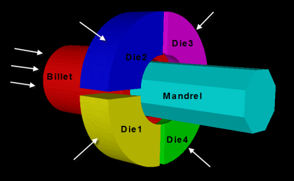

Swaging

Swaging is a process that is used to reduce or increase the diameter of tubes. A swagged piece created by placing the tube inside a die that applies compressive force by hammering radially.
The term swage can apply to the process of swaging (verb), or to a die or tool used for swaging (noun).

Manufacturing Processes: As a general manufacturing process swaging may be broken up into two categories. The first category of swaging involves the workpiece being forced through a confining die to reduce its diameter, similar to the process of drawing wire. This may also be referred to as "tube swaging." The second category involves two or more dies used to hammer a round workpiece into a smaller diameter. This process is usually called "rotary swaging" or "radial forging". Tubes may be tagged (reduced in diameter to enable the tube to be initially fed through the die to then be pulled from the other side) using a rotary swagger, which allows them to be drawn on a draw bench. Swaging is normally the method of choice for precious metals since there is no loss of material in the process.
Swaging can be further expanded by placing a mandrel inside the tube and applying radial compressive forces on the outer diameter. Thus, through the swage process, the inner tube diameter can be a different shape, for example a hexagon, and the outer is still circular.

 

<table align="center">
  <tr valign="top">
    <td align="center" width="350">
       
      <b>Figure 1:</b> Tube Swaging
    </td>
  </tr>
</table>

 

Rotary swaging: Rotary swaging process is usually a cold working process, used to reduce the diameter, produce a taper, or add point to a round workpiece. It can also impart internal shapes in hollow workpieces through the use of a mandrel (the shape must have a constant cross-section). Swaging a bearing into a housing means flaring its groove's lips onto the chamber of the housing. A swaging machine works by using two or four split dies which separate and close up to 2000 times a minute. This action is achieved by mounting the dies into the machine's spindle which is rotated by a motor. The spindle is mounted inside a cage containing rollers (looks like a roller bearing). The rollers are larger than the cage so as the spindle spins the dies are pushed out to ride on the cage by centrifugal force, as the dies cross over the rollers they push the dies together because of their larger size. On a four-die machine, the number of rollers cause all dies to close at a time; if the number of rollers do not cause all pairs of dies to close at the same time then the machine is called a rotary forging machine, even though it is still a swaging process.
