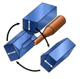

### Theory

**Swaging** is a process that is used to **reduce or increase the diameter of tubes**. A swagged piece is created by placing the tube inside a **die** that applies **compressive force** by **hammering radially**. The term swage can apply to the process of swaging (verb), or to a die or tool used for swaging (noun).

### Manufacturing Processes

As a general manufacturing process, swaging may be broken up into **two categories**:

1. **Tube Swaging**: The first category of swaging involves the workpiece being forced through a **confining die** to reduce its diameter, similar to the process of drawing wire. This may also be referred to as "tube swaging."

2. **Rotary Swaging or Radial Forging**: The second category involves **two or more dies** used to hammer a round workpiece into a smaller diameter. This process is usually called "rotary swaging" or "radial forging".

Tubes may be **tagged** (reduced in diameter to enable the tube to be initially fed through the die to then be pulled from the other side) using a rotary swagger, which allows them to be drawn on a draw bench. 

Swaging is normally the **method of choice for precious metals** since there is **no loss of material** in the process. Swaging can be further expanded by placing a **mandrel** inside the tube and applying radial compressive forces on the outer diameter. Thus, through the swage process, the inner tube diameter can be a different shape, for example a **hexagon**, and the outer is still circular.

 
<b>Figure 1: Tube Swaging</b>  

<video width="600" height="400" controls autoplay loop muted style="max-width: 100%; height: auto;">
  <source src="images/SwagingGraph.mp4" type="video/mp4">
  Your browser does not support the video tag.
</video>

 

### Rotary Swaging

**Rotary swaging** process is usually a **cold working process**, used to:
- Reduce the diameter
- Produce a taper
- Add point to a round workpiece

It can also impart **internal shapes** in hollow workpieces through the use of a **mandrel** (the shape must have a constant cross-section). Swaging a bearing into a housing means flaring its groove's lips onto the chamber of the housing. 

A **swaging machine** works by using **two or four split dies** which separate and close up to **2000 times a minute**. This action is achieved by mounting the dies into the machine's **spindle** which is rotated by a motor. The spindle is mounted inside a cage containing **rollers** (looks like a roller bearing). 

The rollers are larger than the cage so as the spindle spins the dies are pushed out to ride on the cage by **centrifugal force**. As the dies cross over the rollers they push the dies together because of their larger size. On a **four-die machine**, the number of rollers cause all dies to close at a time; if the number of rollers do not cause all pairs of dies to close at the same time then the machine is called a **rotary forging machine**, even though it is still a swaging process.

 
<b>Figure 2: Rotary Swaging</b>  

A variation of the rotary swagger is the **creeping spindle swaging machine** where both the spindle and cage revolve in **opposite directions**. This prevents the production of **fins** between the dies where the material being swagged grows up the gap between the dies. 

There are **two basic types** of rotary swaging machine:
1. **Standard (tagging machine)**
2. **Butt swaging machine**

A **butt swaging machine** works by having sets of **wedges** that close the dies onto the workpiece by inserting them between the annular rollers and the dies, normally by the use of a **foot pedal**. A butt swaging machine can allow a workpiece to be inserted without the dies closing on it. For example, a three foot workpiece can be inserted 12 inches and then the dies closed, drawn through until 12 inches remain and the dies are then released. The finished workpiece would then, for example, be four feet long but still of its initial diameter for a foot at each end.

### Applications

### Electronics

In **Printed Circuit Boards (PCB)** assembly, individual connector pins are sometimes **pressed/swagged** into place using an **arbor press**. Some pins have a hollow end that is pressed over by the arbor's tool to form a **mushroom shaped retaining head**. Typical pin diameter range from **0.017 to 0.093 inches** or larger. The swaging is an **alternative or supplement to soldering**.

### Pipes and Cables

The most common use of swaging is to **attach fittings to pipes or cables** (also called **wire ropes**). The parts loosely fit together, and a **mechanical or hydraulic tool** compresses and deforms the fitting, creating a **permanent joint**. 

**Pipe flaring machines** are another example. Flared pieces of pipe are sometimes known as:
- **Swage nipples**
- **Pipe swages**
- **Swaged nipples**
- **Reducing nipples**

In furniture, legs made from **metal tubing** (particularly in commercial furniture) are often swaged to improve strength where they come in contact with the ground, or casters.

### Saw Blade Teeth

In sawmills, a swage is used to **flare large bandsaw or circle saw teeth**, which increases the width of the cut, called the **kerf**. A clamp attaches a mandrel and die to the tooth and the eccentric die is rotated, swaging the tip. A much earlier version of the same operation used a **hardened, shaped swage die** and a hand held hammer. 

Saw teeth formed in this way are sometimes referred to as being **"set"**. A finishing operation, **shaping**, cold works the points on the tooth sides to flats. It might be considered as a side swage. This slightly reduces the tooth width but increases the operating time between "fittings." Swaging is a **major advance over filing** as the operation is faster, more precise and greatly extends the working life of a saw.

### Firearms and Ammunition

In **internal ballistics**, swaging describes the process of the bullet entering the barrel and being **squeezed to conform to the rifling**. Most firearm bullets are made **slightly larger than the inside diameter** of the barrel, so that they are swaged to engage the rifling and form a **tight seal** upon firing. 

In **ammunition manufacture**, swaged bullets are bullets manufactured by swaging **room temperature metals** into a die to form it into the shape of a bullet. In contrast, swaged bullets, since they are formed at the temperature at which they will be used, can be formed in molds of the **exact desired size**. This means that swaged bullets are generally **more precise than cast bullets**. 

The swaging process also leads to **fewer imperfections**, since voids commonly found in casting would be pressed out in the swaging process. The swaging process in reference to **cold flow of metals** into bullets is the process not of squeezing the metals into smaller forms but rather pressing smaller thinner items to form into shorter and slightly wider shapes. 

Swaging is used to form **unjacketed bullets**, usually made of a mix of **lead and antimony** to improve working properties (lead alone is usually too soft). Many reloading equipment manufacturers started by marketing both reloading and bullet swaging dies and equipment.
